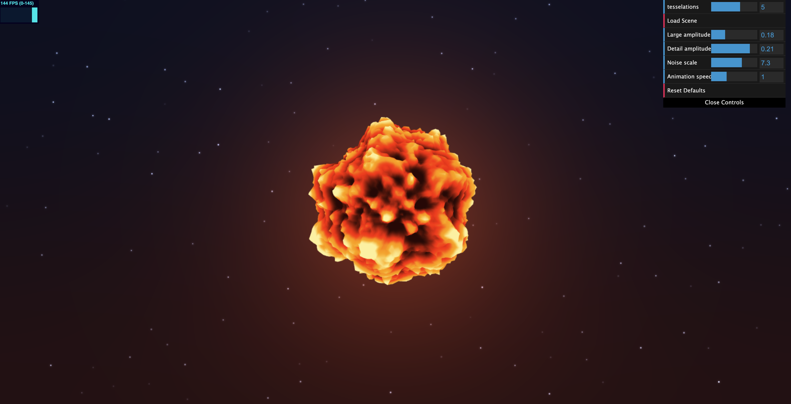
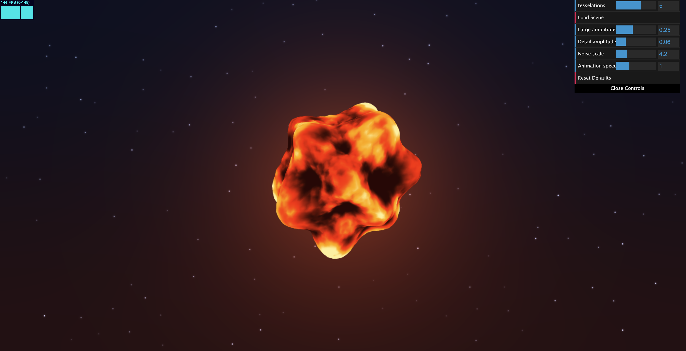
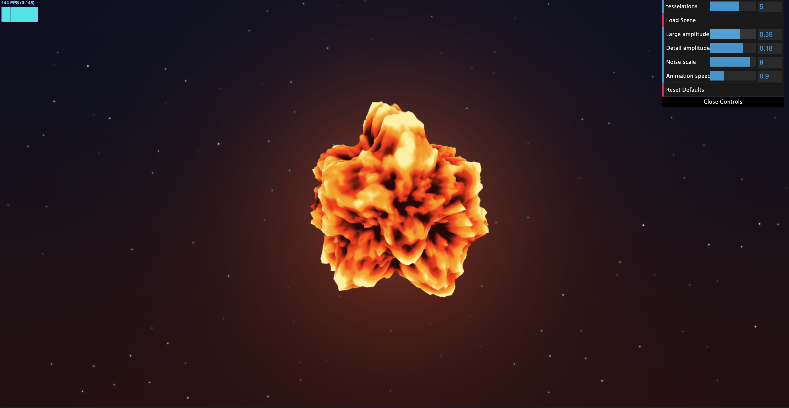

# HW 1: WebGL Fireball

## Link to Live Demo

[Live Demo](https://codfish3.github.io/hw01-fireball/)

## Screenshot

## Implementation

### Surface Displacement

The fireball starts from a subdivided icosphere. Its vertex shader displaces vertices along their original surface normals using two layers:

- Three sinusoidal waves create broad, animated changes to the silhouette.
- Four octaves of 3D value noise add finer surface detail through fBM.

The value noise interpolates pseudorandom values at the eight corners of each grid cell using Hermite-smoothed interpolation weights. Each fBM octave doubles the sampling frequency and halves the amplitude. The sum is normalized by the accumulated weights.

Time offsets the noise sampling coordinates, making the surface evolve continuously.

### Fire Colors

The vertex shader passes displacement and noise values to the fragment shader. These values define a visual heat signal, which is mapped to a gradient of dark red, orange, yellow, and pale yellow.

A time-dependent oscillation and a moving pulse-shaped highlight add variation to the colors. Surface color is output directly to create an emissive appearance.

### Toolbox Functions

| Function | Use |
|---|---|
| `sin` | Animates large-scale deformation, heat variation, and star twinkling |
| `mix` | Interpolates noise samples and blends colors |
| `smoothstep` | Smooths color transitions and star edges |
| `pulse` | Creates a localized highlight within the heat gradient |

### Extra Feature: Procedural Background

A separate full-screen shader renders:

- A dark blue-to-red gradient.
- Procedural stars with randomized positions, sizes, and brightness.
- Independent star twinkling with different speeds and phases.
- Two overlapping warm glows centered on the screen.

The background glow is a screen-space effect rather than bloom. It stays centered when the camera moves. Aspect-ratio correction keeps the glow circular.

## Interactive Controls

| Control | Default | Description |
|---|---:|---|
| Tessellations | 5 | Icosphere subdivision level |
| Large amplitude | 0.18 | Strength of the sinusoidal deformation |
| Detail amplitude | 0.21 | Strength of the fBM displacement |
| Noise scale | 7.3 | Spatial scale of the noise sampling |
| Animation speed | 1.0 | Shared speed of fireball animation and star twinkling |

- Set **Animation speed** to `0` to pause the animation.
- **Reset Defaults** restores the parameters listed above.
- **Load Scene** rebuilds the scene geometry.
- Drag on the canvas to orbit and use the scroll wheel to zoom.

Animation time is accumulated using frame-to-frame elapsed time, allowing speed changes without jumping to a different animation phase.